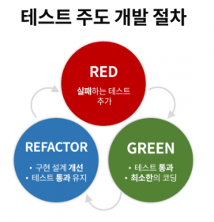
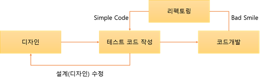

# TDD(Test-Driven-Development)방법론
TDD란 Test Driven Development의 약자로 `테스트 주도 개발`이라고 함.  
반복 테스트를 이용한 소프트웨어 방법론으로, `작은 단위의 테스트 케이스`를 작성하고 이를 통과하는 코드를 추가하는 단계를 반복하여 구현함.  
짧은 개발 주기의 반복에 의존하는 개발 프로세스이며, 애자일 방법론 중 하나인 eXtream Programming(XP)의 `Test-First` 개념에 기반을 둔 단순한 설계를 중요시한다

- eXtream Programming(XP)
    ```
    미래에 대한 예측을 최대한 하지 않고, 
    지속적으로 프로토타입을 완성하는 애자일 방법론 중 하나이다.
    이 방법론은 추가 요구사항이 생기더라도, 실시간으로 반영할 수 있다. 
    ```

- 단위 테스트(Unit Test)
    ```
    한 단위(일반적으로 class)만을 테스트하는 것
    ```

## TDD 개발주기
  

`RED` 단계에서는 **실패하는 테스트 코드**를 먼저 작성한다.  
`GREEN` 단계에서는 **테스트 코드를 성공시키기 위한 실제 코드**를 작성한다.  
`BLUE` 단계에서는 중복 코드 제거, 일반화 등의 **리팩토링**을 수행한다. 

중요한 것은 `실패하는 테스트 코드`를 작성할 때까지 `실제 코드를 작성하지 않는 것`과, 실패하는 테스트를 통과할 정도의 `최소 실제 코드`를 작성해야 하는 것이다.

## TDD 개발


### TDD 개발 방식
TDD와 일반적인 개발 방식의 가장 큰 차이점은 `테스트 코드를 작성한 뒤에 실제 코드를 작성`한다는 점임.  

디자인(설계) 단계에서 프로그래밍 목적을 반드시 `미리 정의`해야만 하고, 또 무엇을 테스트해야 할지 `미리 정의(테스트 케이스 작성)`해야만 한다.  
테스트 코드를 작성하는 도중에 발생하는 예외 사항(버그, 수정사항)들은 테스트 케이스에 추가하고 설계를 개선한다. 이후 테스트가 통과된 코드만을 코드 개발 단계에서 실제 코드로 작성한다. 


### TDD를 적용한 사례
생년월일(input)을 입력받으면 현재 나이(output)를 출력하는 프로그램

1. 처음에는 간단한 것으로 목표를 정한다. (태어난 해와 올해의 연도를 입력해서 연도 뺄셈을 통해 나이 계산)
   - 2015, 2018 -> (만)3살 우선 이것을 만들겠다는 생각을 한다.

2. 만들기도 전에 만든 후에 무엇을 테스트할지를 설계한다. (실패하는 테스트)
   - 2015, 2018를 입력하면 2가 나오는 테스트 프로그램(장차 만들 프로그램을 테스트할 코드)를 만든다.

3. 그 다음에 그 테스트를 통과할 프로그램(1.을 목표로 작성한 코드)를 만든다.
   - 2018 - 2015 (올해의 연도 - 태어난 해)

4. 테스트 프로그램으로 이 프로그램(3.에 해당하는 코드)을 실행한다.

5. 통과했으면 새로운 테스트를 추가한다.
   - 이번에는 생월을 추가했을 때 계산하는 프로그램

6. 위와 같은 작업을 계속 왔다갔다 수행한다.

## TDD 개발방식의 장점
1. 디버깅 시간 단축
2. 코드가 내 손을 벗어나기 전에 가장 빠르게 피드백 받을 수 있다.
3. 작성한 코드가 가지는 불안정성을 개선하여 생산성을 높일 수 있다.
4. 재설계 시간을 단축 할 수 있다.
5. 추가 구현이 용이하다.

## TDD 개발방식의 단점
1. 생산성의 저하
2. 이제까지 자신이 개발하던 방식을 많이 바꿔야 한다.
3. TDD는 이렇게 해야된다는 이미지/틀이 있다. 


참고  
[Reference1](https://inpa.tistory.com/entry/QA-%F0%9F%93%9A-TDD-%EB%B0%A9%EB%B2%95%EB%A1%A0-%ED%85%8C%EC%8A%A4%ED%8A%B8-%EC%A3%BC%EB%8F%84-%EA%B0%9C%EB%B0%9C)  
[Reference2](https://wooaoe.tistory.com/33)  
[Reference3](https://media.fastcampus.co.kr/knowledge/dev/tdd/)